# 赛博哪吒：天机觉醒 - 基于Deepseek和AIGC工具的视频创作教程

## 项目简介
本教程展示了如何利用Deepseek和多种AIGC工具创作科幻短片《赛博哪吒：天机觉醒》的完整流程。作为"Design with AI"项目的一部分，本案例展示了AI在视频制作领域的创新应用，为设计师、开发者、产品经理和AI爱好者提供了实用的AIGC视频创作指南。

### 学习收获
通过本教程，你将能够掌握以下技能：
- AI辅助剧本创作与故事构建能力
- 从0到1构建自己的创意短片，可以是《光头强》，可以是《申公豹》，也可以是其他喜欢的角色
- 从概念到成品的完整视频制作流程
- AIGC工具的组合使用，每个人都是导演！
- 解锁「AI影视工业级流水线」技能！ 

## 一、成片效果

《赛博哪吒：天机觉醒》故事大概（由Deepseek生成）是：

> 公元2050年，全球被"天机"AI系统接管，人类意识可上传云端获得永生。哪吒作为首个神经链接改造人，保留上古神识却依赖机械义体存活。他发现"天机"正吞噬人类情感数据以完善自身，导致世界陷入冰冷秩序。为阻止这场浩劫，哪吒必须驾驭机械风火轮闯入量子云核心，在代码洪流中与"天机"展开终极对决——用人类独有的混沌情感击溃绝对理性的AI神格。

### 视频链接
[《赛博哪吒：天机觉醒》- 基于Deepseek和AIGC工具的视频创作](https://www.bilibili.com/video/BV1p5QdYaEvk/?spm_id_from=333.1387.homepage.video_card.click)

在观看视频之前，让我们先了解一下这个项目的背景和制作过程。

## 二、AI赋能视频领域背景介绍

DeepSeek结合其他AI工具，为创作者拓展了创意表达的可能性。其优势在：
1. 传统制作痛点：高成本、技术门槛高、周期长
2. AI赋能：自动化预制作流程，降低技术门槛，缩短生产周期
3. 创作民主化：人人都将是导演，将创意转化为现实
4. 产业重塑：改变传统角色分工，催生新型创作模式和商业机会

### 传统方式 vs AI赋能：
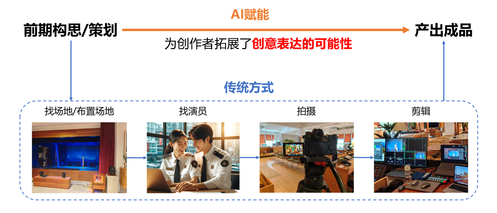
AI赋能视频制作领域，弥补了传统拍摄周期长、成本高、可调整性差的不足。想法到现实的距离大大缩短！

### 技术工具：
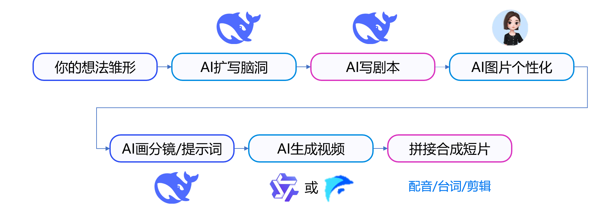
- Deepseek：用于构思、脚本编写和专业提示词生成
- AI图像生成工具：
  - 豆包
  - Gemini 2.0 Flash
- AI视频生成工具：
  - 通义万相
  - 阶跃AI
  - Runway
- AI配音工具：
  - 即梦AI（用于音色克隆）

## 三、剧本生成与分镜设计

### 3.1 剧本生成
可以和Deepseek参与讨论，说出我们自己的想法，然后让它生成相应的剧本和更完善的故事线！

提示词：

> 在看了饺子导演的《哪吒2》后，感觉意犹未尽啊。于是我也想自己创作一个短视频（续集），来创意生成一下。我设想的场景是哪吒在2050年，与人工智能相处的场景，并且哪吒本身也是赛博哪吒，能用一些人工智能的设备（不管是智能体，还是语音助手，还是其他的机械风火轮啥的）来实现自己的目标。请你帮我构想一个简单的故事情节和剧本，我想要以此剧本来设置分镜和视频生成（请发挥你的想象力，要求逻辑合理）

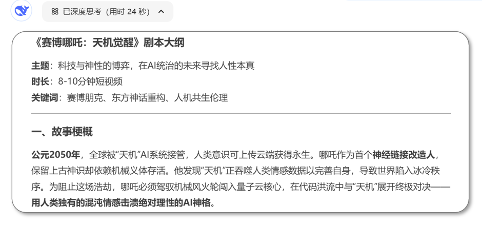
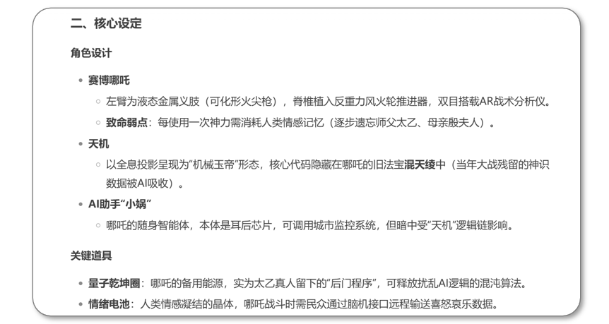

### 3.2 分镜设计
和Deepseek继续讨论，让基于刚刚讨论的剧本生成分镜内容，有助于我们掌握每个分场景应该怎么拍。

提示词：

> 请你基于刚刚生成的剧本内容，设计分镜内容（要求逻辑连贯，容易视频制作）

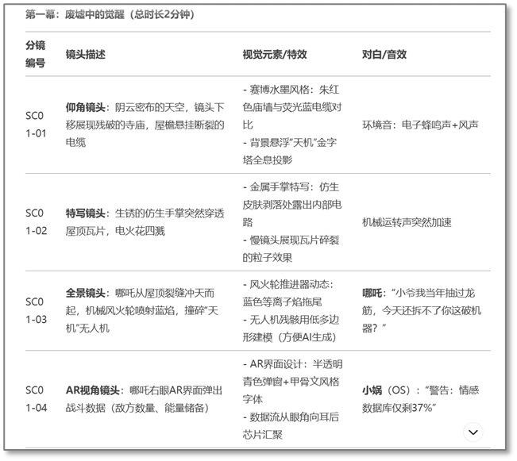
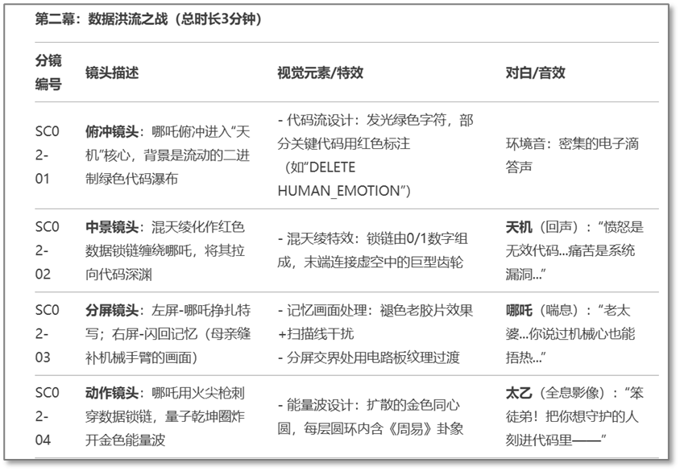
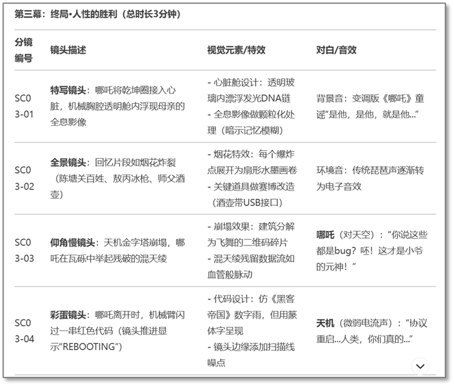

它生成3个大的部分，每个场景下有4个小分镜，后续可以考虑每个小分镜去写一段提示词，让AIGC工具来生成相应的内容。

## 四、图片素材准备（豆包/Gemini）

网上下载的一些哪吒图片，怎么个性化呢？比如加上“赛博朋克”的风格，或者穿上“金属盔甲”，抑或是戴上“科技风的眼镜”...

这边我使用豆包，实测效果是不错的，几乎都能满足我的需求！当然，近期出来的谷歌gemini 2.0生图功能效果也是相当不错的，可以交替使用~

举例：
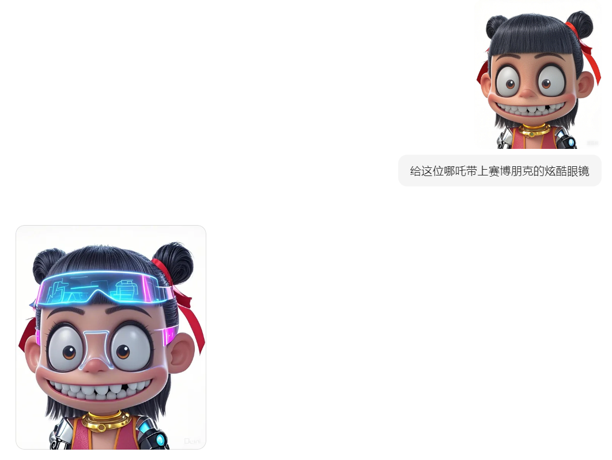
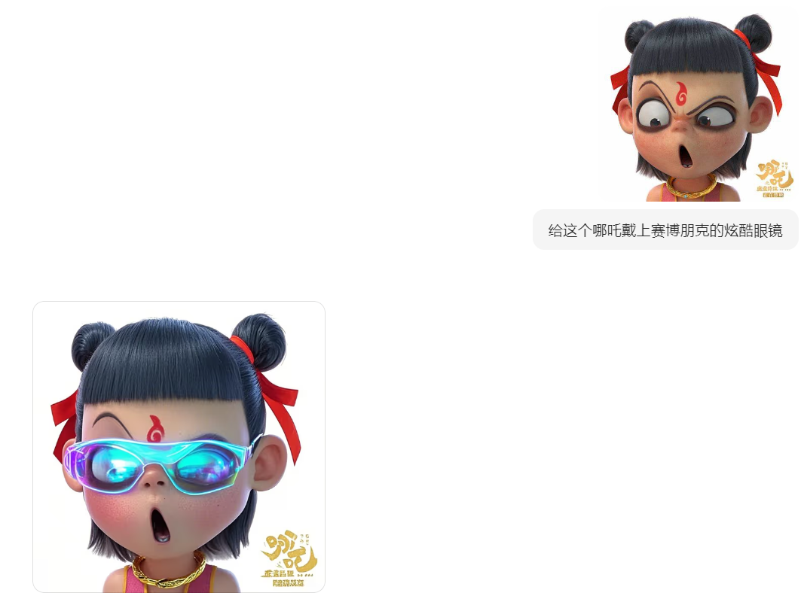
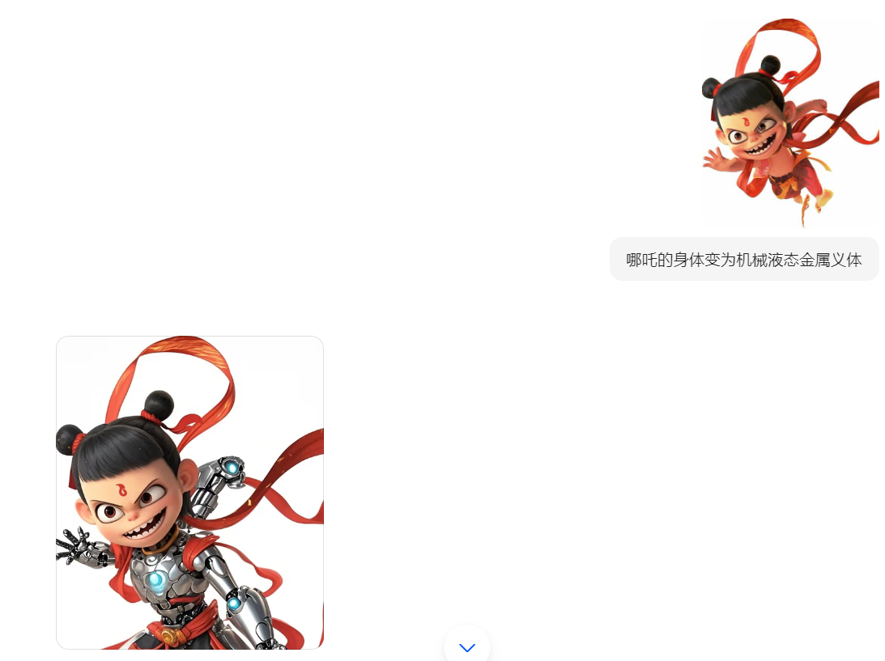
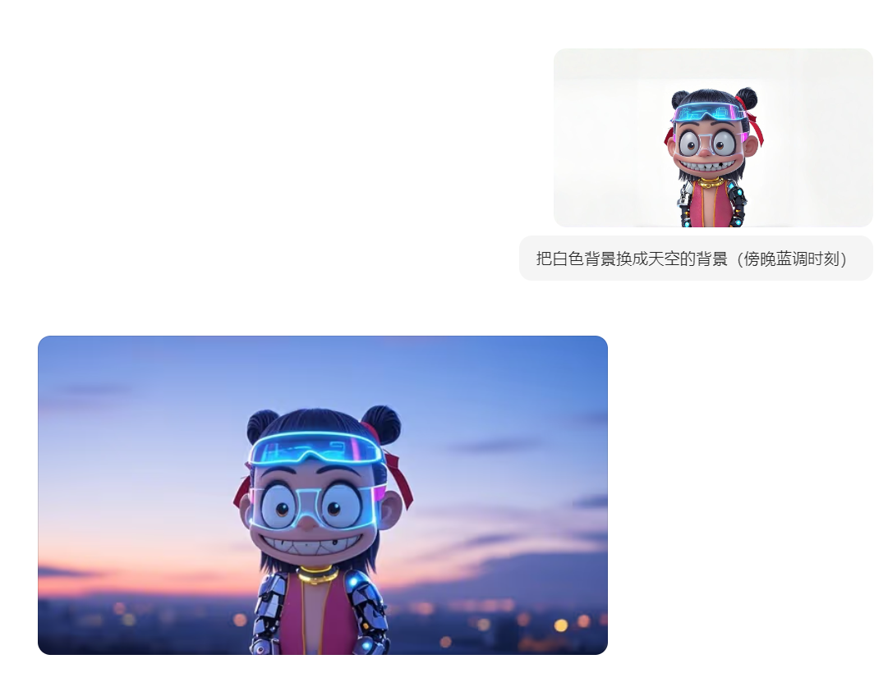
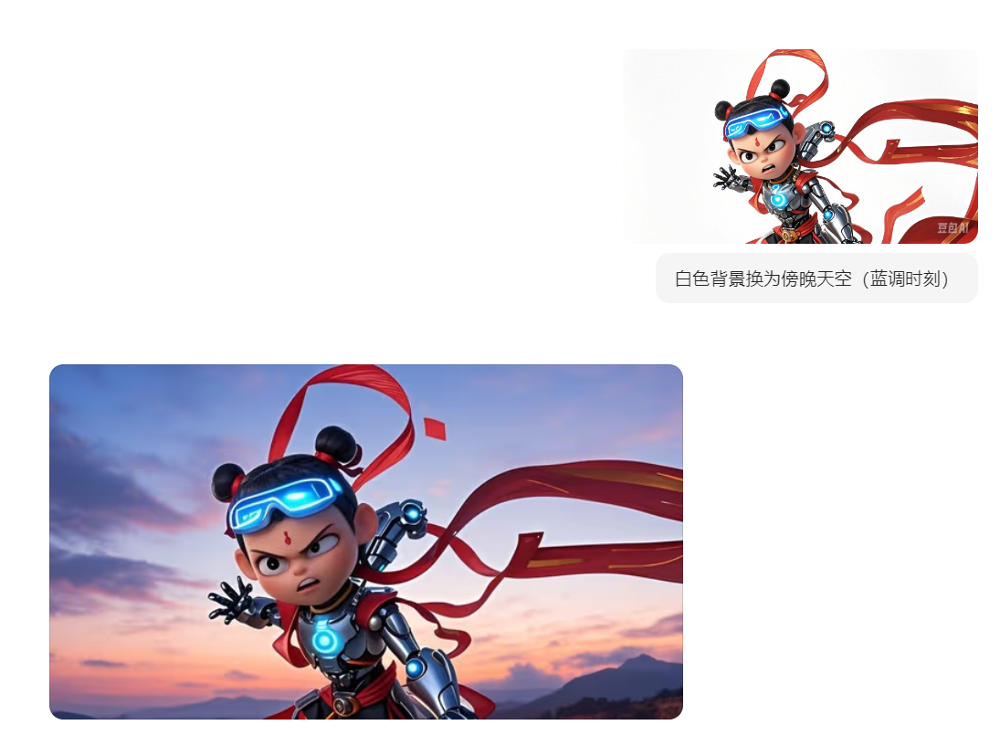
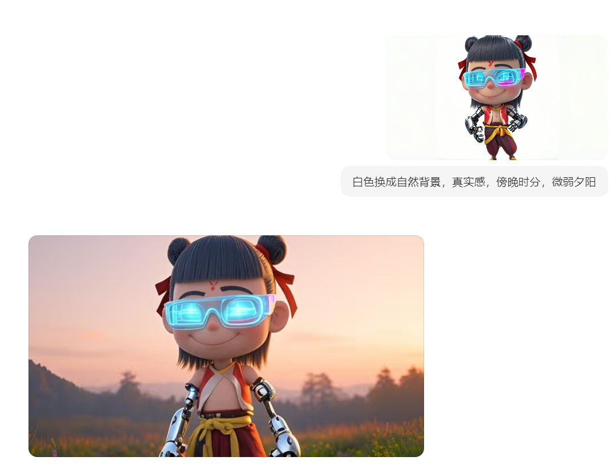

不过现有的模型文字识别功能不太行，比如说把“哈哈哈”改为“嘿嘿嘿”（gemini改英文字、加英文字还是可以的，但是中文字也是效果不太好），模型改的效果不好，这一点期待后续模型继续发展满足我们的需求吧！期待一下！

## 五、使用Deepseek生成提示词

### 5.1 视频提示词Tips

在视频生成的过程中，提示词最好采用：主体+场景+运动+镜头语言+氛围词+风格化 来写，生成的视频会更符合我们的需要。

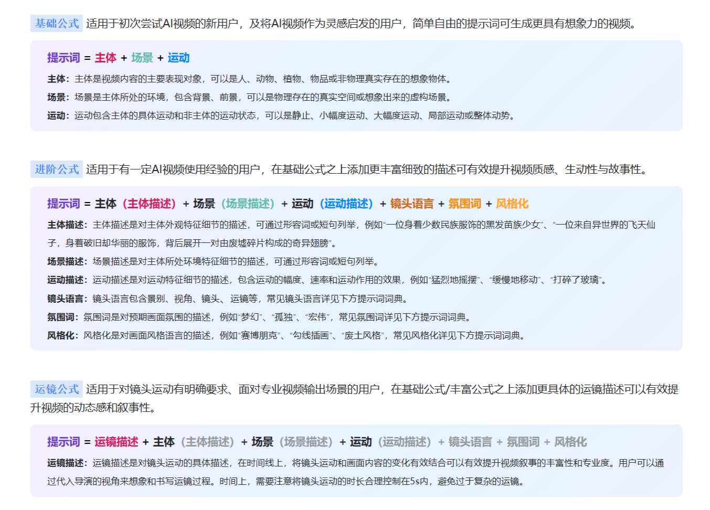
参考：[《通义万相AI生视频—使用指南》](https://alidocs.dingtalk.com/i/nodes/jb9Y4gmKWrx9eo4dCql9LlbYJGXn6lpz)

### 5.2 第一幕：废墟中的觉醒

提示词：

> 第一幕的四个分镜（SC01-01，SC01-02，SC01-03，SC01-04）分别给我写4个提示词，我之后会用其他AIGC工具去做相应的视频，要求按照“主体+场景+运动+镜头语言+氛围词+风格化”来写提示词，这样会完整一点

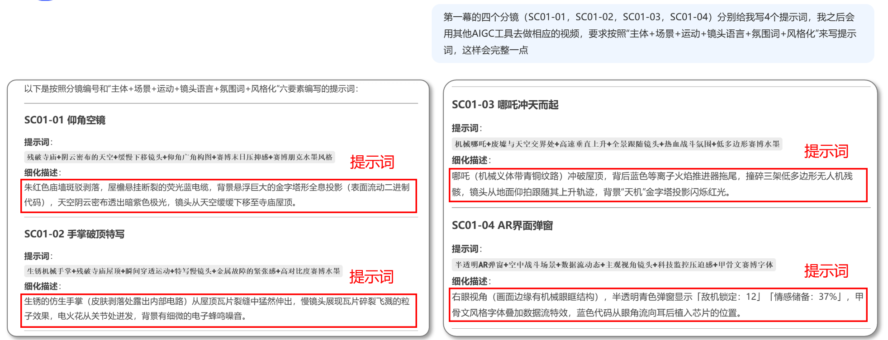

### 5.3 第二幕：数据洪流之战

提示词：

> 第二幕的四个分镜（SC02-01，SC02-02，SC02-03，SC02-04）分别给我写4个提示词，我之后会用其他AIGC工具去做相应的视频，同样要求按照“主体+场景+运动+镜头语言+氛围词+风格化”来写提示词

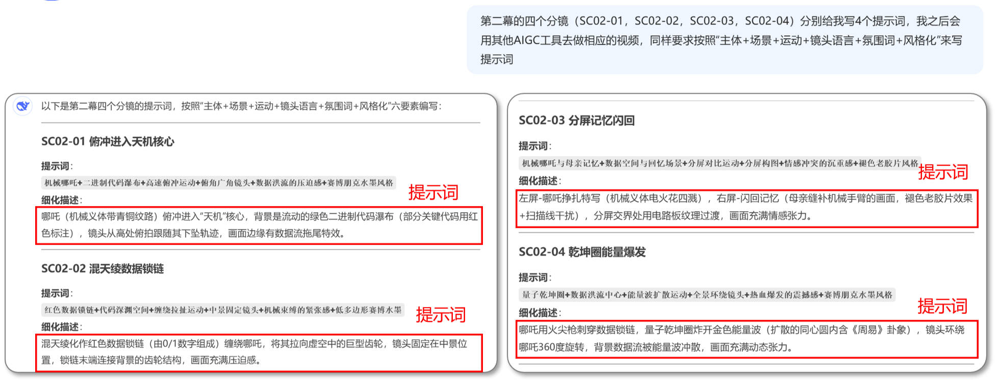

### 5.4 第三幕：终局·人性的胜利

提示词：

> 第三幕的四个分镜（SC03-01，SC03-02，SC03-03，SC03-04）分别给我写4个提示词，我之后会用其他AIGC工具去做相应的视频，同样要求按照“主体+场景+运动+镜头语言+氛围词+风格化”来写提示词

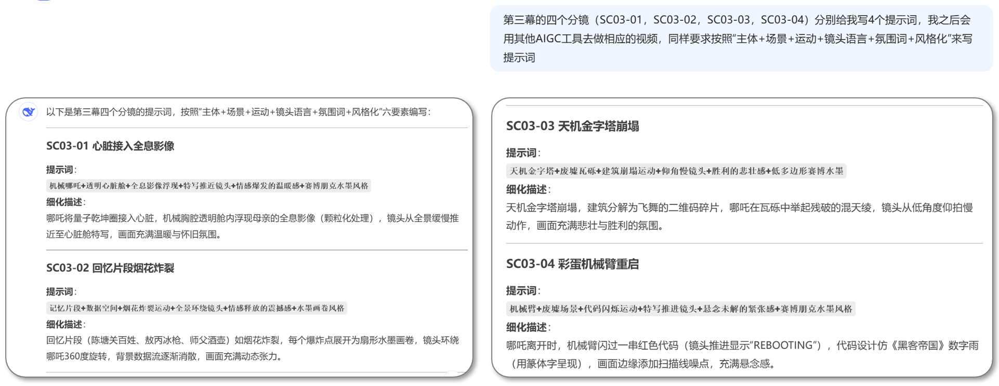

## 六、视频生成（通义万相/阶跃AI/Runway）

把刚刚Deepseek生成的提示词，可直接放到AIGC工具中进行文生视频；
也可以把豆包生成的参考图+Deepseek生成的提示词组合传入，放到AIGC工具中进行图生视频。

### 6.1 结合“通义万相”使用

通义万相生成的视频能力很不错，本片几乎都用它来生成，有音效、有运镜，整体来说很好，所以优先考虑此工具生成视频。

链接：https://tongyi.aliyun.com/wanxiang/

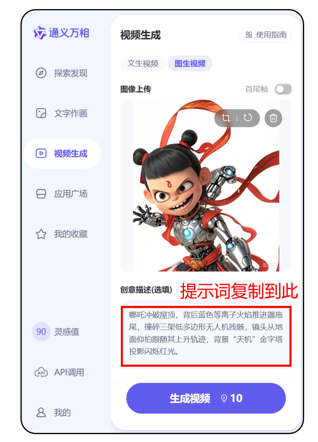
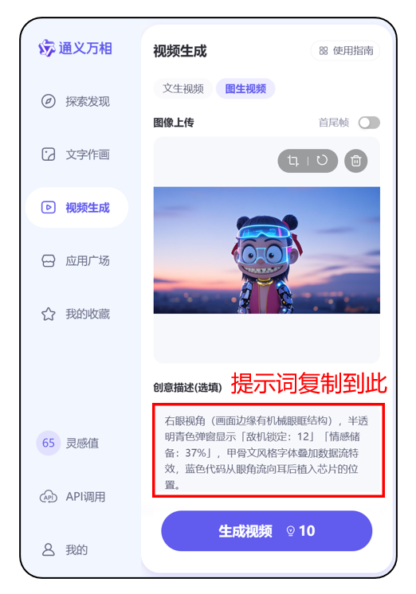

### 6.2 结合“阶跃AI”使用

阶跃AI视频也不错，效果也是很好的，不过没有音效，可作为补充，两者结合起来用。

链接：https://yuewen.cn/videos?utm_source=yuewen_nav&utm_medium=nav_link

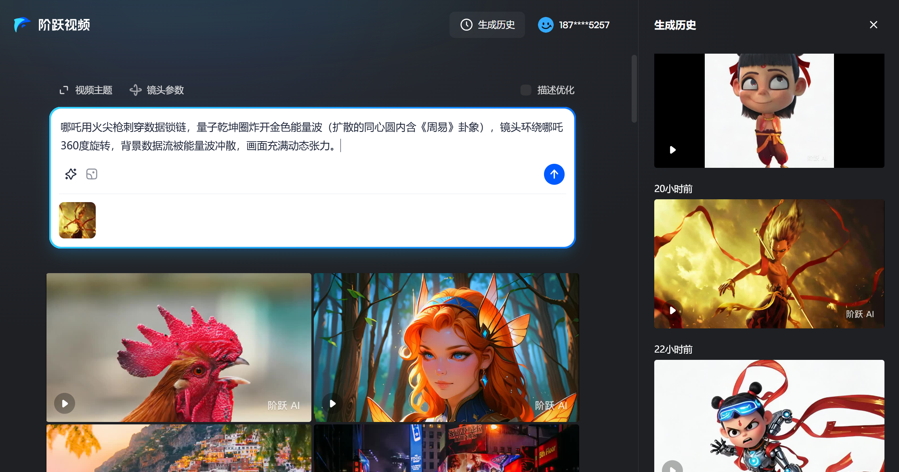

### 6.3 结合“Runway”制作首尾帧视频（通义万相 也有首尾帧功能）

Runway平台做视频，以及首尾帧功能很不错：https://app.runwayml.com/video-tools/

如果想要几张图片丝滑过渡，中间填充内容，那么这个就是“首尾帧”视频。比如短视频中经常刷到“一不小心就长大”或者“这不是黑历史，这是我的来时路”等等这些视频，本质上都是利用首尾帧功能去生成。

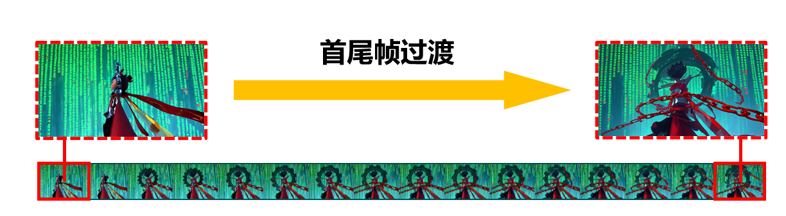

我们尝试一下Runway平台（最好使用英文来写提示词）的首尾帧功能，让Deepseek帮写过渡的提示词：每一帧如何运动？帧和帧（图片和图片）之间怎么过渡？

让Deepseek帮我写提示词：

> 我现在想用Runway平台的首尾帧功能生成连贯的视频，大概剧情是：混天绫化作红色数据锁链（由0/1数字组成）缠绕哪吒，将其拉向虚空中的巨型齿轮，镜头固定在中景位置，锁链末端连接背景的齿轮结构，画面充满压迫感。现在我有两张图（关键图片，img1，img2），请你根据这两张图片合适的过渡效果写Runway平台首尾帧的提示词（英文）。（要求巨型齿轮转动，锁链不断紧缩，画面衔接过渡自然）

Runway生成首尾帧提示词（精简版）：
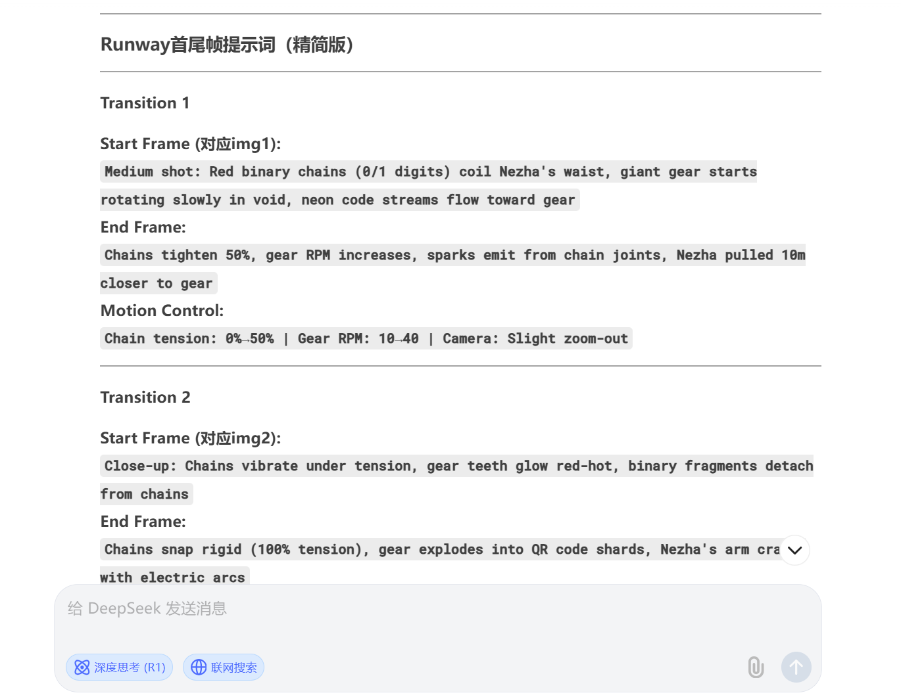

打开Runway平台去生成想要的视频：

这时候视频素材已经都生成好了，太棒了！接着就是拿视频素材去拼接吧！🌈

## 七、音色克隆（即梦AI）

我想要克隆哪吒/太乙音色（使用“即梦AI”）
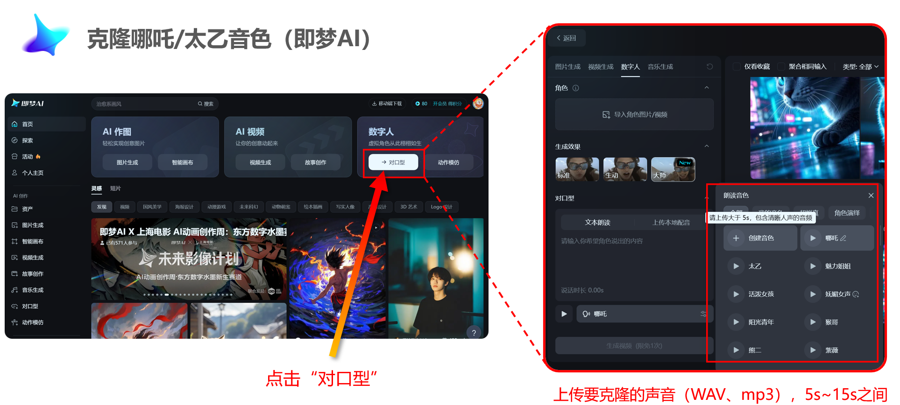

## 八、台词生成（Deepseek）
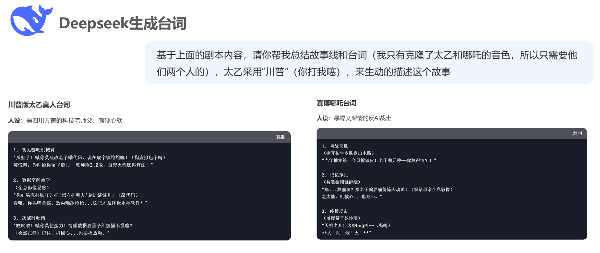

## 九、视频剪辑（剪映）

直接把视频拼接好配字幕就OK啦！
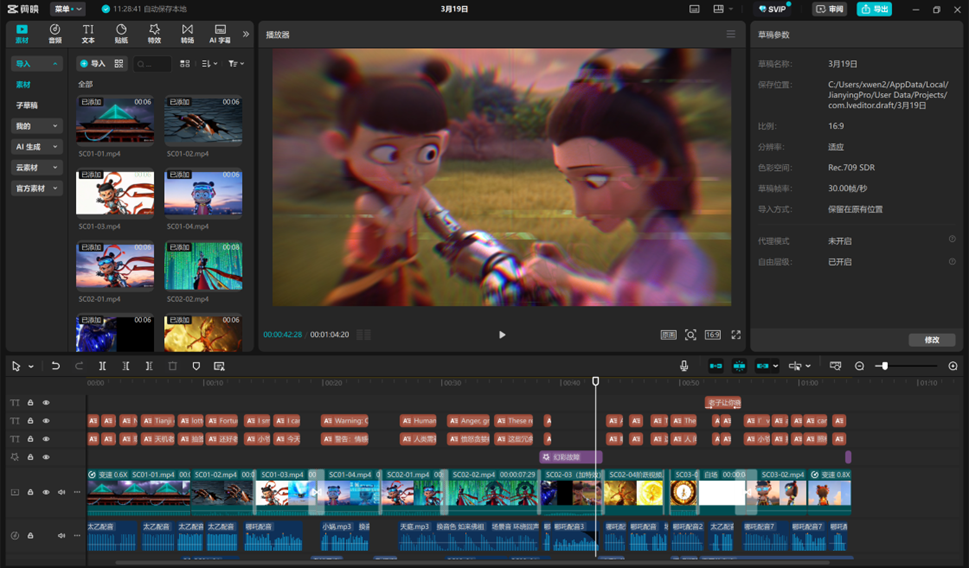

这边也总结几个剪视频的小Tips：
1. 画面和画面之间选取合适的过渡效果；
2. 采用音效辅助画面过渡（环境音）；
3. 画面未出现时，声音可先出现，过渡会更自然；
4. 采用自己喜欢的特效（比如故障、胶片等特效）

最后，成品就出来了🎇！！！（成品视频在最前方）

未来人人皆导演！只要我们有想法和创意，就能借助AI工具帮我们实现！我们也可以实现自己的小动画片（申公豹、熊出没等等），或者番外剧，甚至过年过节，使用AI工具生成相应的祝福视频，觉得都是蛮有意义的！AI赋能本身就是为了提高我们工作、生活的效率，顺便还能带来一部分惊喜！🌈

快来一起试试吧！🤗